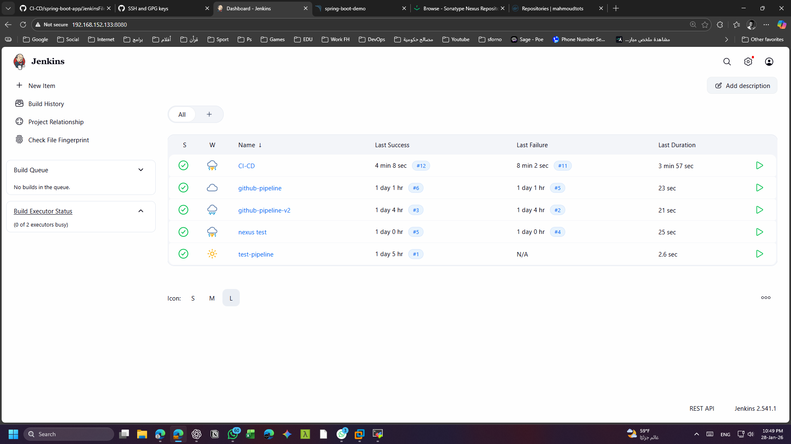
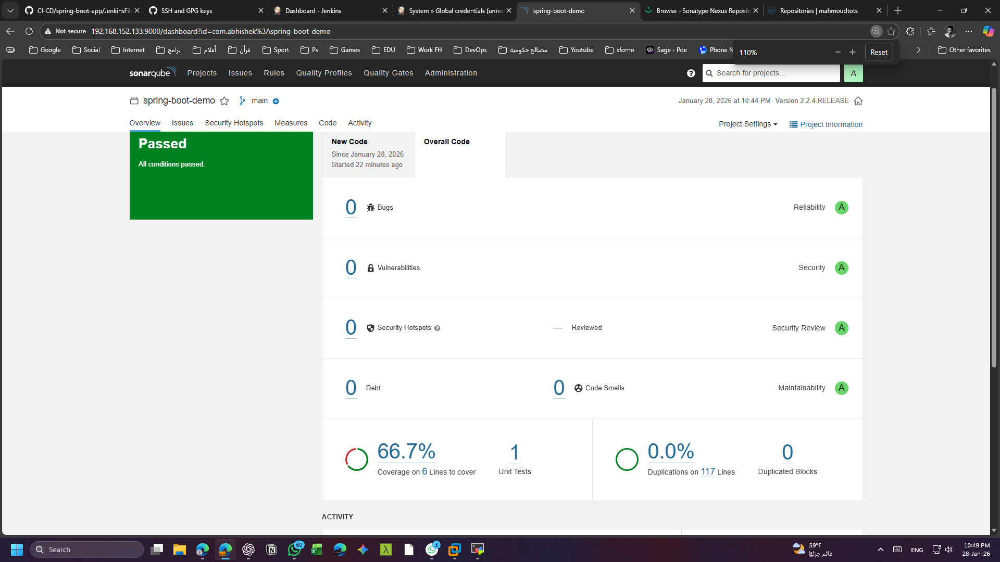
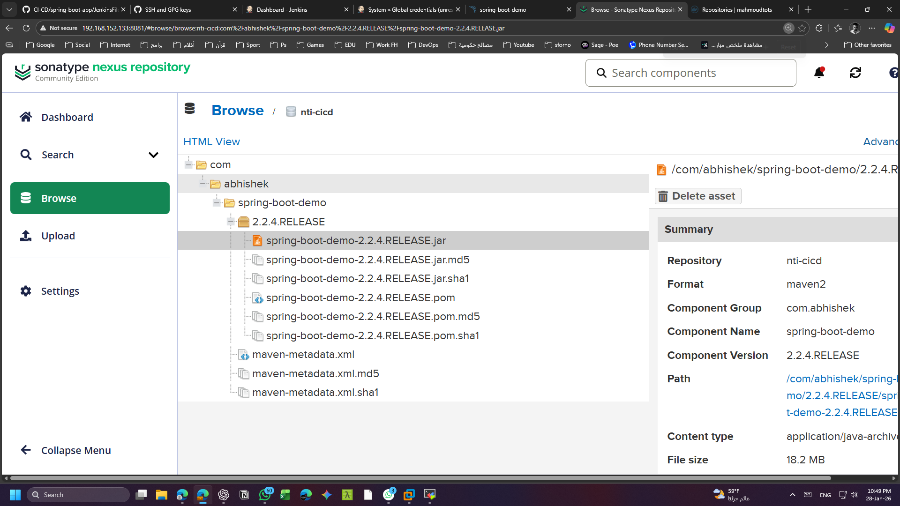
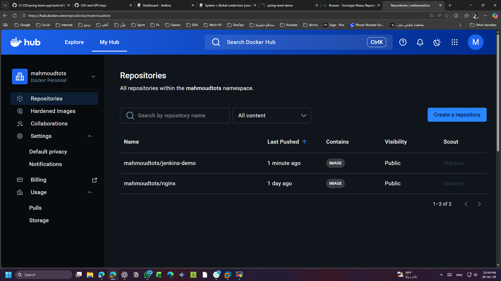
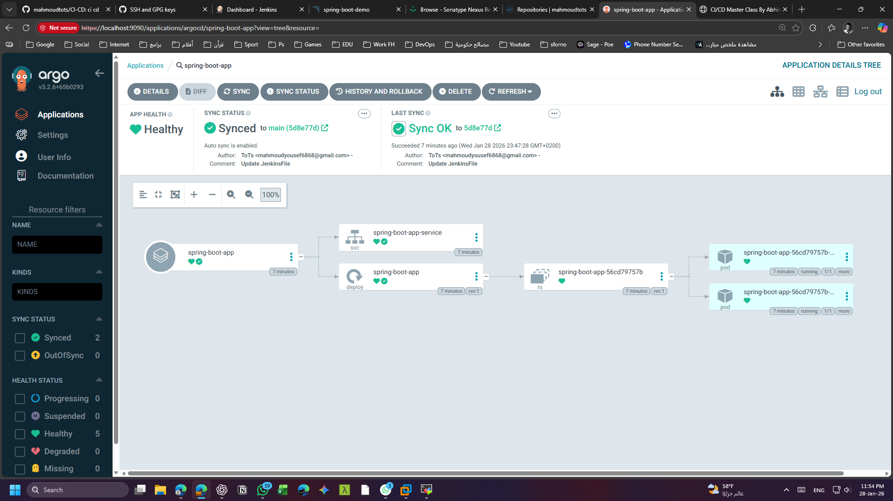
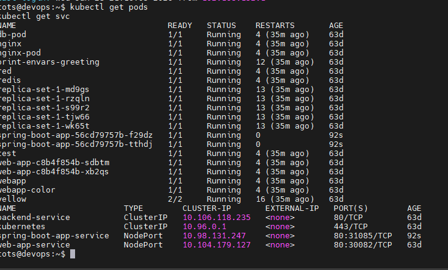
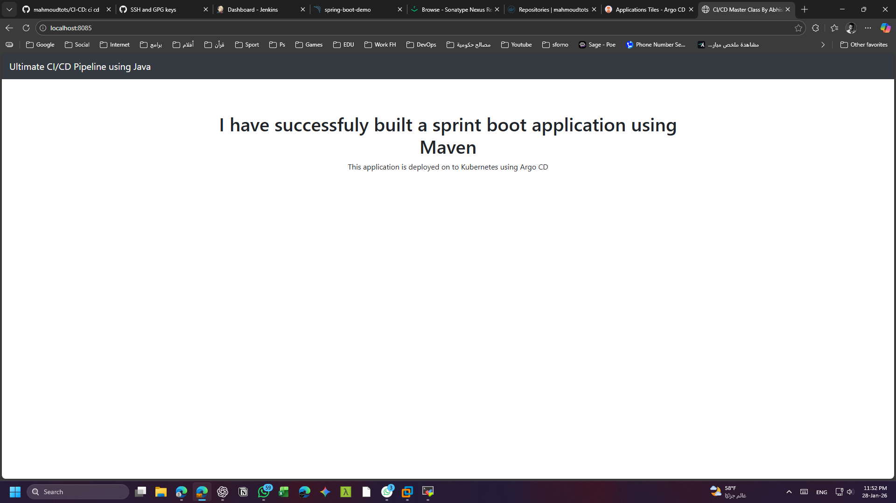

# End-to-End CI/CD Pipeline with Jenkins, ArgoCD & Kubernetes

This project demonstrates a complete **End-to-End CI/CD pipeline** using modern DevOps tools.
The pipeline starts from source code commit and ends with automatic deployment on Kubernetes using **GitOps**.

---

## 🧱 Architecture Overview


**Flow:**
1. Developer pushes code to GitHub
2. Jenkins triggers CI pipeline
3. Maven builds the application
4. SonarQube performs static code analysis
5. Artifact is uploaded to Nexus Repository
6. Docker image is built and pushed to Docker Hub
7. ArgoCD detects changes and deploys automatically to Kubernetes

---

## 🛠️ Tools & Technologies

- **Jenkins** – CI Pipeline
- **Maven** – Build & Dependency Management
- **SonarQube** – Code Quality & Static Analysis
- **Nexus Repository** – Artifact Management
- **Docker** – Containerization
- **Docker Hub** – Image Registry
- **Kubernetes (Minikube)** – Container Orchestration
- **ArgoCD** – GitOps Continuous Deployment
- **GitHub** – Source Code Management

---

## 📂 Project Structure

```text
.
├── spring-boot-app/
│   ├── JenkinsFile
│   ├── Dockerfile
│   └── pom.xml
├── spring-boot-app-manifests/
│   ├── deployment.yml
│   └── service.yml
├── images/
└── README.md
```
## 🔄 CI Pipeline (Jenkins)



### Stages
- Checkout source code
- Build & test application
- Static code analysis (SonarQube)
- Publish artifact to Nexus
- Build & push Docker image to Docker Hub
---
## 🔍 Static Code Analysis (SonarQube)



- Code quality analysis
- Bug & vulnerability detection
- Quality Gates enforcement
---

## 📦 Artifact Repository (Nexus)



- Maven artifacts are stored in Nexus
- Centralized artifact management

---

## 🐳 Docker Image



- Docker image built automatically
- Tagged and pushed to Docker Hub

---

## 🚀 Continuous Deployment with ArgoCD



- GitOps-based deployment
- Automated Sync
- Self Heal
- Prune enabled

---

## ☸️ Kubernetes Deployment



- Application deployed on Kubernetes
- Service exposed using NodePort

---

## 🌐 Application Access



- The application is accessible through the Kubernetes service endpoint

---

## ✅ Key Highlights

- Fully automated CI/CD pipeline
- Secure credentials management
- GitOps-based Continuous Deployment
- Production-ready DevOps workflow

---

## 📌 Conclusion

This project showcases a real-world **DevOps CI/CD implementation**
from source control to automated Kubernetes deployment using Jenkins and ArgoCD.

