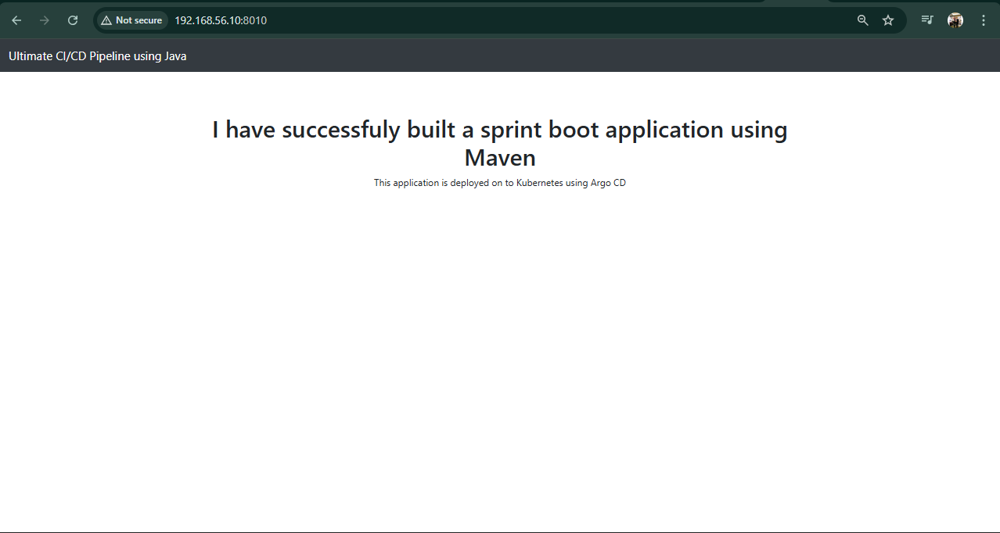
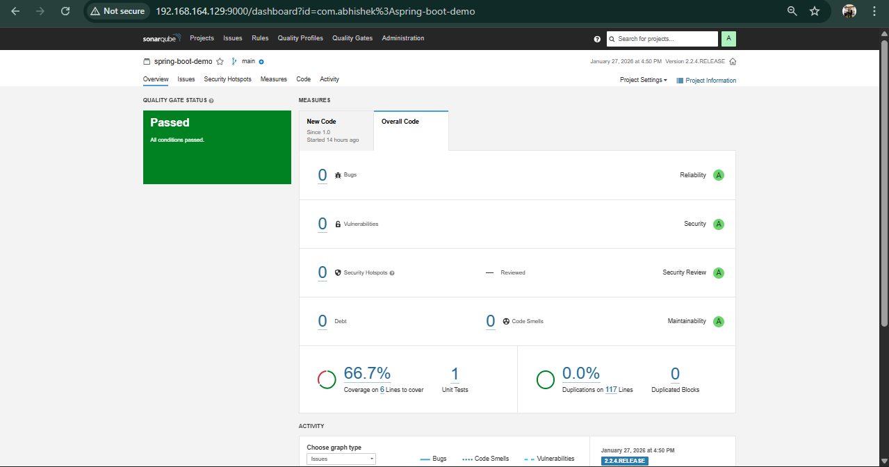
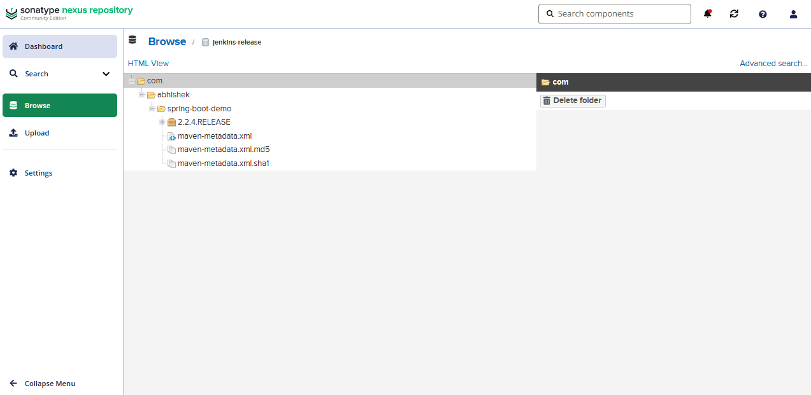
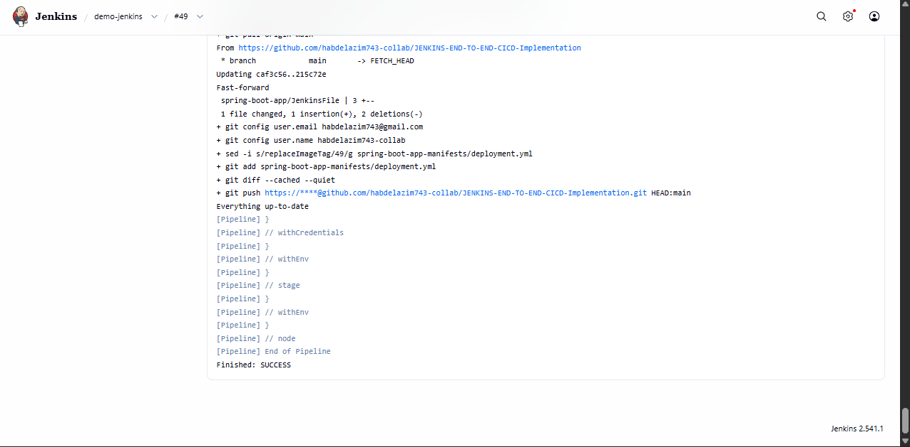
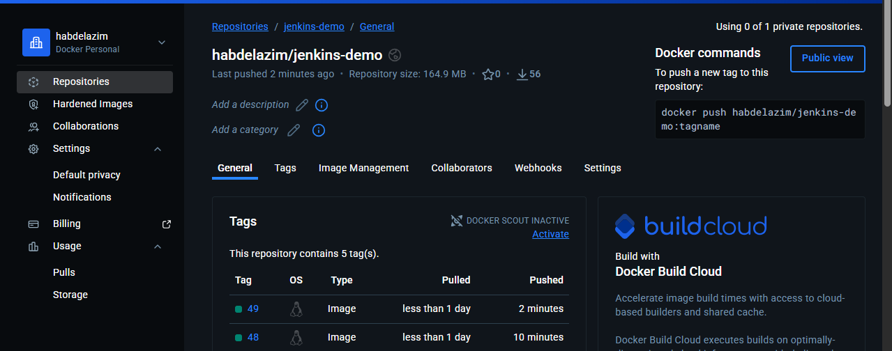
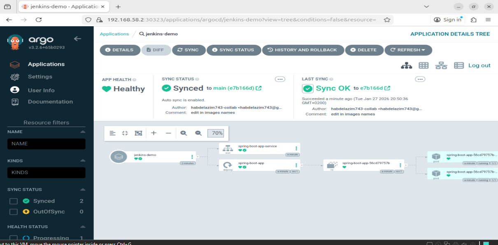
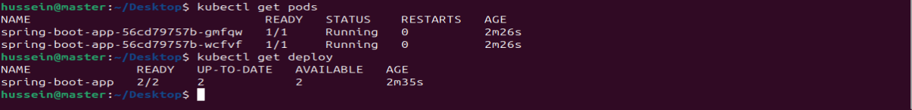

# Jenkins End-to-End CI/CD Pipeline 🚀

This repository demonstrates a **complete end-to-end CI/CD pipeline** for a Java-based application using:

**Jenkins · Maven · SonarQube · Nexus · Docker · Helm · Kubernetes (Minikube) · Argo CD**

---

## 📌 Prerequisites

* Java application source code (GitHub)
* Jenkins Server
* Docker & Docker Hub account
* SonarQube Server
* Nexus Repository Manager
* Kubernetes Cluster (Minikube)
* Helm
* Argo CD installed on Kubernetes

---

## 1️⃣ Local Development Setup

* Developers write and test code locally
* Code is pushed to GitHub
* Maven is used for dependency management and build

---

## 2️⃣ Code Quality & Coverage (SonarQube + JaCoCo)

* Unit tests run automatically in Jenkins
* **JaCoCo** generates coverage reports
* **SonarQube Quality Gates** prevent bad code from reaching production

---

## 3️⃣ Artifact Management – Nexus Repository

* Build artifacts are uploaded to **Nexus**
* Centralized and versioned artifact storage

---

## 4️⃣ Jenkins CI/CD Pipeline

### Pipeline Stages

1. Checkout source code from GitHub
2. Build application using Maven
3. Run unit tests + coverage
4. SonarQube code analysis
5. Build Docker image
6. Push Docker image to Docker Hub
7. Trigger GitOps deployment via Argo CD

---

## 5️⃣ Docker Hub Repository

* Docker images are tagged and pushed automatically
* Used later by Kubernetes during deployment

---

## 6️⃣ Argo CD – GitOps Deployment

* Argo CD continuously monitors the Git repository
* Uses **GitOps** to sync Kubernetes state with Git
* Automatically deploys new versions when manifests change

---

## 7️⃣ Deployment on Minikube (Kubernetes)

* Application deployed on **Minikube**
* Kubernetes resources managed using **Helm charts**
* Argo CD ensures desired state = live state

---

## 🔄 End-to-End Flow Summary

1. Developer pushes code to GitHub
2. Jenkins CI pipeline starts
3. Tests & SonarQube checks run
4. Artifact stored in Nexus
5. Docker image built & pushed to Docker Hub
6. Argo CD deploys application to Minikube

---

## ✅ Key Benefits

* Fully automated CI/CD pipeline
* Strong code quality enforcement
* GitOps-based Kubernetes deployment
* Scalable & production-ready architecture

---

⭐ If you like this project, don’t forget to give it a star!
